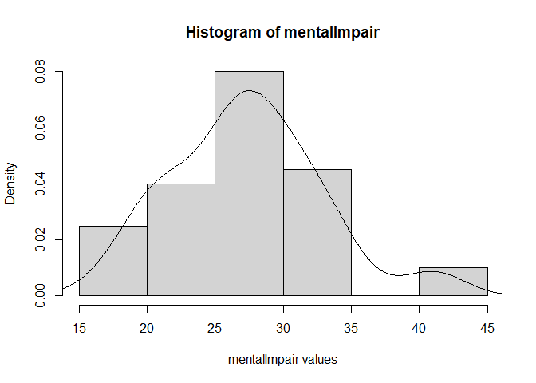
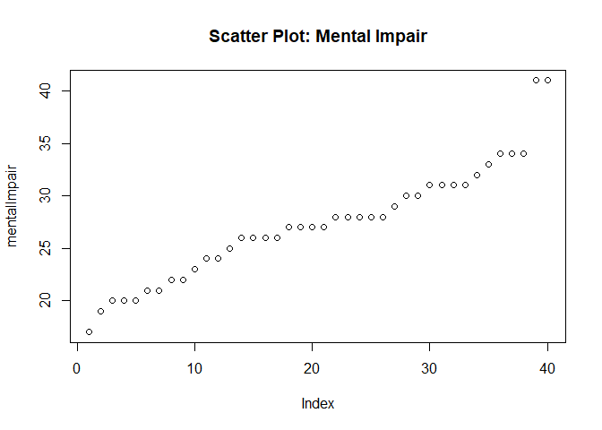
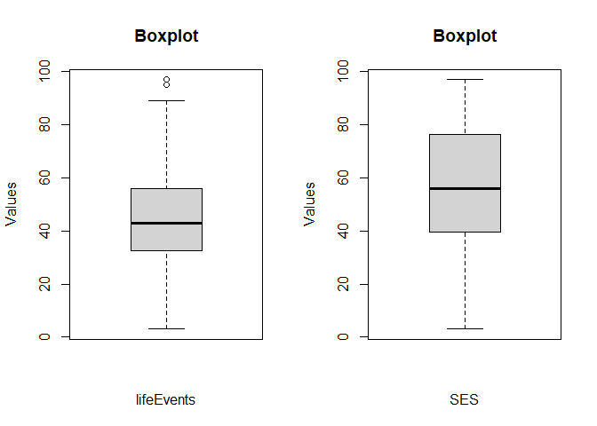
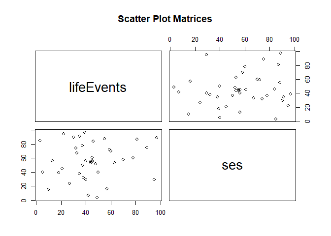
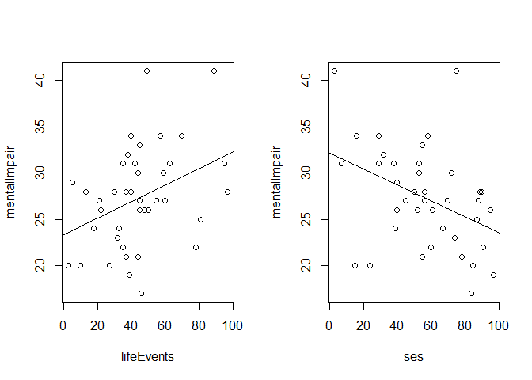
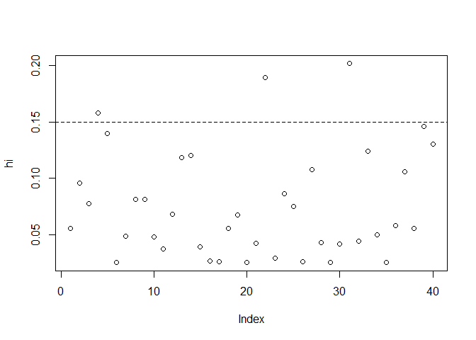
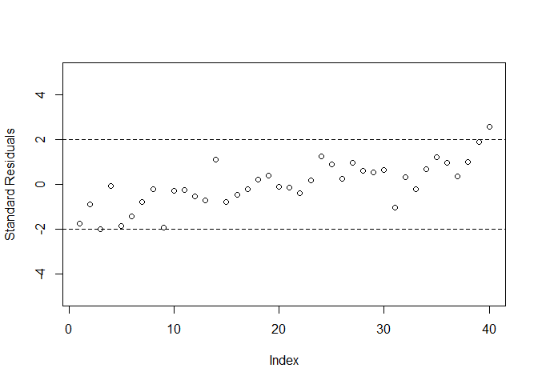
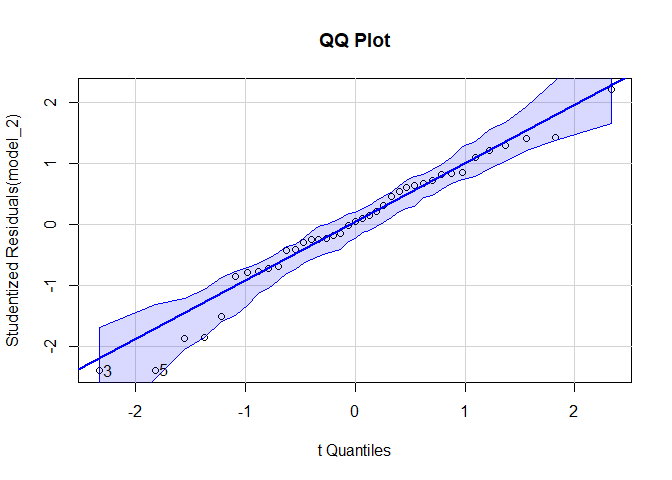
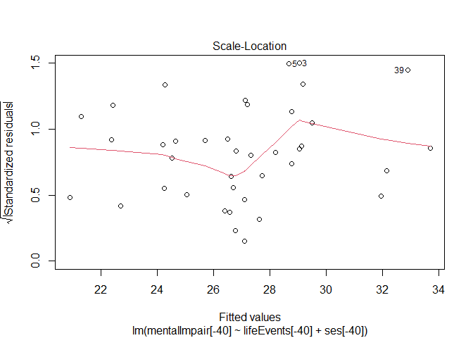
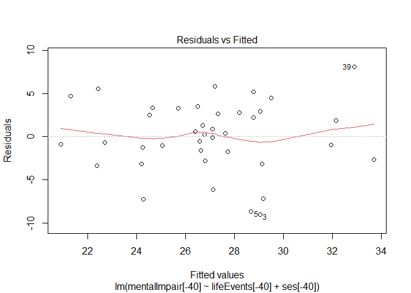

Modelo de Regressão Linear Múltipla
================
Gabriel Monteiro
17/08/2021

## Introdução

Esta atividade tem como objetivo aplicar os conhecimentos obtidos na
disciplina de Modelos de Regressão 2 em um conjunto de dados específico,
modelando uma variável resposta de interesse com base em algumas
variáveis explicativas(preditores).  
Um modelo pode ser entendido como uma representação simplificada de um
fenômeno, porém que consegue captar alguns aspectos relevantes, como a
relação de uma variável de interesse com outras variáveis e o “impacto”
de cada uma dessas outras variáveis explicativas na variável resposta.
Neste projeto, iremos ajustar um Modelo de Regressão Linear Múltipla
(com 2 preditores) em um conjunto de dados que será apresentado na
próxima seção.

## O conjunto de dados

Agresti e Finlay (1997) relatam dados de um estudo da Flórida que
investigou a relação entre a saúde mental e várias variáveis
explicativas usando uma amostra aleatória de 40 sujeitos.  
O conjunto de dados utilizado é referente ao estudo mencionado acima, e
pode ser acessado através da seguinte fonte:
<http://data.princeton.edu/wws509/datasets/afMentalHealth.dta>  
Como pode ser observado, no banco de dados foram listados apenas 2
preditores e a variável resposta.  
A variável resposta é o índice de deficiência mental que incorpora
medidas de ansiedade e depressão (mentalImpair).  
As duas variáveis explicativas presentes no conjunto de dados são o
escore/índice de eventos que combina o número e a gravidade de vários
eventos de vida estressantes (lifeEvents) e um índice de status
socioeconômico (SES).  
Com o banco de dados que será utilizado para a análise de regressão
apresentado, iremos no próximo tópico explorá-lo um pouco mais e
adquirir algumas informações que nos auxilie no estudo em questão.

## Análise Exploratória dos dados

Nesta seção vamos analisar os dados que iremos trabalhar e buscar
algumas informações que direcionem nossas análises. Inicialmente,
observaremos se existe alguma observação/registro sem valor atribuído.
Como podemos ver a seguir, o conjunto de dados não conta com células sem
valor associado:

``` r
dados = read.dta("afMentalHealth.dta")

colSums(is.na(dados))
```

    ## mentalImpair   lifeEvents          ses 
    ##            0            0            0

Agora iremos avaliar nossa variável resposta: mentalImpair. Através do
histograma abaixo e da curva de densidade estimada apresentada, podemos
ver que mentalImpair segue uma distribuição com forma próxima à Normal.
Vale ressaltar que nas próximas seções iremos avaliar se os resíduos
seguem uma distribuição normal, com o intuito de validar uma das
suposições do modelo de regressão que iremos ajustar. Também podemos
fazer um gráfico de dispersão da variável resposta mentalImpair e
observar que existe suspeita de outlier por conta do valor atípico de
dois pontos em relação aos demais. Iremos abordar esse tópico de forma
mais aprofundada nas seções seguintes.

``` r
mentalImpair = dados$mentalImpair
hist(mentalImpair,xlab = "mentalImpair values",main="Histogram of mentalImpair",prob=TRUE)
lines(density(mentalImpair))
```

<!-- -->

``` r
plot(mentalImpair, main="Scatter Plot: Mental Impair")
```

<!-- -->

Devemos também analisar nossos 2 preditores: lifeEvents e SES. Nas
tabelas abaixo, podemos observar algumas medidas estatísticas que nos
auxiliam a compreender melhor o comportamento dessas variáveis. Para
melhor ilustrução, iremos apresentar o BoxPlot das 2 variáveis em
questão. Observando os gráficos e os quartis das variáveis, percebemos
que em relação a variável LifeEvents, dois valores chamam a atenção por
se distanciar um pouco do restante das observações. Isso pode sugerir a
presença de outliers, e no avançar desse estudo iremos nos aprofundar
nesse tópico, uma vez que a presença de outliers no Modelo de Regressão
pode causar um impacto negativo no ajuste.  
Vale ressaltar também que estamos lidando apenas com variáveis
quantitativas nesse estudo, o que não fará não ser necessário a
introdução de variáveis Dummy no modelo para possíveis variáveis
qualitativas.

``` r
lifeEvents = dados$lifeEvents
ses = dados$ses

summary(lifeEvents)
```

    ##    Min. 1st Qu.  Median    Mean 3rd Qu.    Max. 
    ##    3.00   32.75   43.00   44.42   55.50   97.00

``` r
summary(ses)
```

    ##    Min. 1st Qu.  Median    Mean 3rd Qu.    Max. 
    ##    3.00   39.75   56.00   56.60   75.75   97.00

``` r
par(mfrow=c(1,2))
boxplot(lifeEvents,xlab='lifeEvents',ylab='Values', main='Boxplot')
boxplot(ses,xlab='SES',ylab='Values', main='Boxplot')
```

<!-- -->

Um tópico que também é muito importante na Análise de Regressão é a
Multicolinearidade. Iremos tratar deste tópico nas próximas seções, mas
inicialmente podemos observar que as variáveis explicativas não
apresentam uma correlação linear forte, o que evidenciado pelos gráficos
de dispersão ao ilustrar uma distribuição quase aleatória dos pontos
(sem presença de relação entre as variáveis) e pelo valor do
coefienciente de correlação linear que foi de aproximadamente 0.12, que
constata uma baixa ou quase inexistente correlação linear entre as
variáveis.

``` r
par(mfrow=c(1,1))
pairs(~lifeEvents+ses,data=dados,main='Scatter Plot Matrices')
```

<!-- -->

``` r
cor(lifeEvents,ses)
```

    ## [1] 0.123337

Por fim, podemos ilustar a relação entre a variável resposta
mentalImpair e os preditores individualmente. Constatamos uma relação
linear entre os preditores e mentalImpair, principalmente com relação à
variável SES, onde é observado uma relação linear decrescente entre
mentalImpair e SES.

``` r
par(mfrow=c(1,2))

plot(lifeEvents,mentalImpair)
abline(lm(mentalImpair ~ lifeEvents))
plot(ses,mentalImpair)
abline(lm(mentalImpair ~ ses))
```

<!-- -->

Agora que conhecemos um pouco mais sobre como os dados se comportam,
iremos na seção seguinte apresentar o Modelo de Regressão Linear
Múltipla e realizar o ajuste dos dados.

## Modelo de Regressão Linear Múltipla

O modelo de regressão linear múltipla que pode representar os dados
analisados é dado por:  

<center>

  
  

</center>

onde:

  - ;
  -  são
    os valores observados da variável resposta mentalImpar;
  -  é o intercepto do modelo;
  -  e
     são as inclinações (e parâmetros desconhecidos que serão
    estimados);
  -  são os valores observados da variável explicativa
    lifeEvents;
  -  são os valores observados da variável explicativa SES;
  -  são
    os erros aleatórios não observáveis.

Através da função lm do R, iremos ajustar o modelo de regressão acima e
interpretar seus resultados:

``` r
model_1 = lm(mentalImpair ~ lifeEvents + ses)
summary(model_1)
```

    ## 
    ## Call:
    ## lm(formula = mentalImpair ~ lifeEvents + ses)
    ## 
    ## Residuals:
    ##    Min     1Q Median     3Q    Max 
    ## -8.678 -2.494 -0.336  2.886 10.891 
    ## 
    ## Coefficients:
    ##             Estimate Std. Error t value Pr(>|t|)    
    ## (Intercept) 28.22981    2.17422  12.984 2.38e-15 ***
    ## lifeEvents   0.10326    0.03250   3.177  0.00300 ** 
    ## ses         -0.09748    0.02908  -3.351  0.00186 ** 
    ## ---
    ## Signif. codes:  0 '***' 0.001 '**' 0.01 '*' 0.05 '.' 0.1 ' ' 1
    ## 
    ## Residual standard error: 4.556 on 37 degrees of freedom
    ## Multiple R-squared:  0.3392, Adjusted R-squared:  0.3034 
    ## F-statistic: 9.495 on 2 and 37 DF,  p-value: 0.0004697

Inicialmente, vemos que os preditores são significativos para o modelo,
já que o p-valor baixíssimo (0.003 e 0.00186) indicam a rejeição da
hipótese nula de que os parâmetros
 e
 são iguais a zero (respectivamente). Além disso podemos
observar os valores estimados de  e  pelo método MQO. O valor de
 indica que para um acréscimo unitário em lifeEvents e
mantendo-se as demais variáveis do modelo constante, teremos um
acréscimo médio de  em mentalImpair. A mesma lógica se aplica para
, e daí tiramos a conclusão de que quanto maior é o
escore/índice de eventos que combina o número e a gravidade de vários
eventos de vida estressantes (lifeEvents), maior o acréscimo no índice
de deficiência mental que incorpora medidas de ansiedade e
depressão(mentalImpair). Já a natureza da relação de mentalImpar e SES
é diferente (como já foi observado na análise exploratória da seção
anterior): quanto maior o índice de status socioeconômico (SES), existe
mais decréscimo no índice de mentalImpair.

Essa conclusão obtida através dos coeficientes do modelo é algo que
confirma a noção intuitiva que tínhamos acerca do problema em questão:
no geral, quanto maior o estresse, maior a ansiedade/depressão, e quanto
maior os níveis socioeconômicos, menor os níveis de fragilidade da mente
devido a estresse/ansiedade.

Outro valor que vale a pena se atentar na saída do modelo é o do
, que
indica o quanto da variabilidade da variável resposta é explicada pelos
regressores do modelo, e o valor obtido é um pouco maior do que 30%. O
 por si
só não é um indicador da qualidade do ajuste, porém se contássemos com
um banco de dados com mais variáveis explicativas, seria natural esperar
um aumento deste coeficiente.

Agora iremos analisar se existem outliers impactando o modelo. Outlier é
um tanto quanto problemático quando encontrado ao ajustar um modelo,
pois essa única observação cujo valor da variável resposta apresenta
padrão atípico, pode causar um grande impacto na estimação dos
parâmetros do modelo. Através da análise da diagonal principal da
matriz chapéu e tomando como regra que valores de
 acima de  (K preditores e N observações totais), isto é
,
indicam pontos de alavanca, iremos avaliar nosso conjunto de dados:

``` r
hi = hatvalues(model_1)
plot(1:40,hi,xlab="Index",ylab="hi")
abline(h=6/40,lty=2)
```

<!-- -->

``` r
#identificando os pontos de alavanca:
hi[(hi>6/40)]
```

    ##         4        22        31 
    ## 0.1583791 0.1892663 0.2018441

``` r
dados[(hi>6/40),]
```

    ##    mentalImpair lifeEvents ses
    ## 4            20          3  85
    ## 22           28         97  89
    ## 31           31         95  29

Vale destacar que nem todo ponto de alavanca é um outlier e vice-versa\!
Pontos de alavanca são observações cujo regressores apresentam padrão
atípico, e observamos 3 deles nos nossos dados.  
Para identificar outliers, que são de fato um problema, podemos observar
o resíduo studentizado para cada observação. Utilizaremos como “regra”
que, se o módulo do residuo studentizado dado por
 for maior que 2, aquele ponto é um outlier. Podemos facilitar
essa análise através das seguintes funções no R:

``` r
rs = rstandard(model_1)
plot(1:40,rs,xlab="Index",ylab="Standard Residuals",ylim=c(-5,5))
abline(h=2,lty=2)
abline(h=-2,lty=2)
```

<!-- -->

``` r
#identificando os outliers:
rs[(as.double(abs(rs))>2)]
```

    ##       40 
    ## 2.563539

``` r
dados[(as.double(abs(rs))>2),]
```

    ##    mentalImpair lifeEvents ses
    ## 40           41         89  75

Com o resultado acima, podemos considerar que a observação de número 40
é um outlier\! Podemos removê-lá do nosso conjunto de dados e ajustar
um novo modelo sem essa observação, que causa grande impacto nos
coeficientes estimados:

``` r
model_2 = lm(mentalImpair[-40] ~ lifeEvents[-40] + ses[-40])
summary(model_2)
```

    ## 
    ## Call:
    ## lm(formula = mentalImpair[-40] ~ lifeEvents[-40] + ses[-40])
    ## 
    ## Residuals:
    ##     Min      1Q  Median      3Q     Max 
    ## -9.0417 -2.2185  0.2173  2.8760  8.1048 
    ## 
    ## Coefficients:
    ##                 Estimate Std. Error t value Pr(>|t|)    
    ## (Intercept)     29.47533    2.04820  14.391  < 2e-16 ***
    ## lifeEvents[-40]  0.07614    0.03142   2.423 0.020534 *  
    ## ses[-40]        -0.10373    0.02683  -3.866 0.000445 ***
    ## ---
    ## Signif. codes:  0 '***' 0.001 '**' 0.01 '*' 0.05 '.' 0.1 ' ' 1
    ## 
    ## Residual standard error: 4.189 on 36 degrees of freedom
    ## Multiple R-squared:  0.3487, Adjusted R-squared:  0.3125 
    ## F-statistic: 9.636 on 2 and 36 DF,  p-value: 0.0004451

Com este novo modelo, podemos fazer as mesmas análises que foram feitas
com o primeiro. Observamos que o
 teve
um leve acréscimo e que os valores de  mudaram, como era de se esperar (com
destaque para
).  
Agora iremos avaliar também a presença de multicolinearidade entre as
variáveis explicativas. Quando existe multicolinearidade, a estimação
dos parâmetros do modelo tende a ser imprecisa e análise do efeito
marginal de cada regressor na variável resposta é totalmente
prejudicada. A multicolinearidade exata é dada quando as colunas da
matriz de regressores X não são L.I. Já para a multicolinearidade QUASE
exata, o posto(X) = K (Número de Preditores), e

continua não singular, porém com determinante próximo de zero. Como
verificamos na análise exploratória dos dados, o coeficiente correlação
linear entre os 2 regressores foi muito próximo de zero, ou seja,
indicando a fraquíssima ou quase inexistente correlação entre as
variáveis. Para confirmar essa hipótese, também olharemos para os
fatores de inflação de variância (vif). Os ‘vif’ são os elementos da
diagonal da inversa da matriz de correlação entre os regressores e caso
encontremos valores acima de 5, é um indicativo da existência de
multicolinearidade QUASE exata. Iremos calcular os fatores de inflação
de variância atráves da função vif do pacote ‘car’:

``` r
vif(model_2)
```

    ## lifeEvents[-40]        ses[-40] 
    ##        1.008349        1.008349

Como os valores dos fatores de inflação de variância são baixos e
indicam que praticamente os regressores são ortogonais entre si (valor
próximo de 1), confirmamos que não existe multicolinearidade no nosso
modelo. Caso existisse, poderíamos optar por realizar a Regressão Ridge,
onde adicionariamos um pouco de viés nas estimativas dos parâmetros, mas
em contrapartida reduziríamos drasticamente a variância\!  
Agora que já tratamos da presença de pontos outliers e não identificamos
a presença de multicolinearidade entre os regressores, iremos dar
sequência e concluir nossa análise de diagnóstico com o intuito de
validar as suposições do modelo de regressão, e consequentemente,
validar nosso modelo ajustado(model\_2).

## Análise dos Resíduos

Uma das suposições do Modelo de Regressão Linear é de que os resíduos,
isto é, a diferença entre os valores previstos(inferidos) e os
observados, são normalmente distribuídos. Para validar essa suposição,
podemos inicialmente observar como se comporta o qqplot:

``` r
qqPlot(model_2, main= "QQ Plot")
```

<!-- -->

Observamos através do gráfico acima que a distribuição dos resíduos se
assemelha ao dos quantis teóricos, nas caudas foge um pouco do esperado,
mas nada de forma exagerada. Além do que, a amostra tem um tamanho
considerável, então podemos também considerar a convergência dos
resíduos para a distribuição normal, se quisermos ser rigoroso a esse
ponto.  
Para fins de confirmação, podemos utilizar o teste de Bera-Jarque para
confirmar a normalidade dos resíduos:

``` r
jarque.bera.test(residuals(model_2))
```

    ## 
    ##  Jarque Bera Test
    ## 
    ## data:  residuals(model_2)
    ## X-squared = 1.257, df = 2, p-value = 0.5334

Com o p-valor obtido de 0.5334, não rejeitamos a hipótese nula (para
qualquer nível de significância razóavel adotado) de que os resíduos
seguem uma distribuição normal, e assim, validamos a suposição de
normalidade dos resíduos. Caso tivéssemos problemas com não normalidade,
poderíamos realizar transformações como a de Box-Cox, porém a
interpretabilidade do modelo seria afetada devido a transformação dos
dados.

Agora iremos avaliar uma suposição muito importante do modelo: a
homocedasticidade. Uma das suposições do modelo é que a variância dos
resíduos é constante, e quando não observamos isso caímos no problema
que chamamos de heterocedasticidade, que implica no fato de que os
estimadores dos
 através do MQO deixam de ser eficientes na classe de
estimadores lineares e não-viesados. Podemos analisar o gráfico a
seguir, dos valores ajustados em relação à raiz dos resíduos
studentizados. Percebemos que não há indícios de heterocedasticidade, já
que os pontos não se encontram dispersos em “forma de funil”(ou seja,
com variância crescente).

``` r
plot(model_2, which=c(3))
```

<!-- -->

Para confirmar a homocedasticidade, podemos realizar o teste de
Breusch-Pagan ou o teste de Koenker. O teste de Koenker é similar ao
Breusch-Pagan, porém é mais poderoso sob não normalidade dos dados
(resíduos). Como já validamos a normalidade dos resíduos, podemos
utilizar o teste de Breusch-Pagan:

``` r
bptest(model_2,studentize=FALSE)
```

    ## 
    ##  Breusch-Pagan test
    ## 
    ## data:  model_2
    ## BP = 3.229, df = 2, p-value = 0.199

Como o p-valor obtido pelo teste foi de aproximadamente 0.2, não
rejeitamos a hipótese nula de que a variância dos resíduos é constante
para qualquer nível de
 razoável (0.1, 0.05, 0.01…), e assim confirmamos que o nosso
modelo é homocedástico e validamos mais uma suposição da Regressão
Linear Múltipla.

Por fim, devemos verificar se existe autocorrelação nos resíduos. Uma
das suposições do modelo é que os erros são não-correlacionados, isto é,
de que os elementos não diagonais de
") são nulos. Podemos observar o gráfico abaixo dos resíduos e
verificar que aparentemente não existe indicação de autocorrelação dos
resíduos, uma vez que os pontos estão aleatoriamente distribuídos e
apontam pra possível independência dos resíduos:

``` r
plot(model_2, which=c(1))
```

<!-- -->

A título de confirmação, podemos realizar o teste de Durbin Watson:

``` r
dwtest(model_2,alternative="two.sided")
```

    ## 
    ##  Durbin-Watson test
    ## 
    ## data:  model_2
    ## DW = 0.87047, p-value = 6.357e-05
    ## alternative hypothesis: true autocorrelation is not 0

Pelo teste de Durbin Watson, rejeitamos a hipótese nula de que os erros
são não correlacionados, ou seja, consideramos que os erros são
autocorrelacionados.  
Como essa suposição foi violada, uma das alternativas é ajustar um
modelo com estimação através do MQG com erros ARMA(p,q). Porém, podemos
continuar com o modelo atual e os estimadores de
 encontrados
(). Para isto, devemos usar um estimador consistente para
") para construir intervalos de confiança dos
estimadores e realizar teste de hipóteses. Resumindo, optando por essa
última solução, temos uma implementação mais simples e podemos utilizar
o modelo original, em contrapartida teremos intervalos de confiança dos
coeficientes de regressão mais amplos, o que implica em uma menor
precisão e menor poder.  
A seguir usaremos os estimadores robustos à heterocedasticidade e
autocorrelação (HAC) para solucionar o problema:

``` r
coeftest(model_2,vcov=vcovHAC(model_2))
```

    ## 
    ## t test of coefficients:
    ## 
    ##                  Estimate Std. Error t value  Pr(>|t|)    
    ## (Intercept)     29.475330   3.137747  9.3938 3.214e-11 ***
    ## lifeEvents[-40]  0.076144   0.034143  2.2302  0.032061 *  
    ## ses[-40]        -0.103732   0.034769 -2.9835  0.005092 ** 
    ## ---
    ## Signif. codes:  0 '***' 0.001 '**' 0.01 '*' 0.05 '.' 0.1 ' ' 1

Percebemos agora que a variância dos estimadores são maiores (através da
comparação dos std. error), como era de esperar após a aplicação do
método citado, e que resulta consequentemente num maior intervalo de
confiança para
().

## Conclusão

Este projeto final da disciplina de Modelos de Regressão 2 foi uma
oportunidade muito rica de consolidar todos os conhecimentos adquiridos
durante este período. Buscar um conjunto de dados, realizar uma análise
exploratória e depois ajustar um modelo de regressão múltipla buscando
entender detalhadamente o máximo possível de sua construção, estimação,
suposições, etc. trouxe grande aprendizado sobre como realizar
modelagens estatísticas dessa natureza, e com certeza, me sinto mais
preparado para realizar ajustes de novos modelos de Regressão nos mais
diversos conjuntos de dados, uma vez que conheço melhor a teoria por
trás de sua construção e seu uso.  
Referente ao conjunto de dados utilizados, ajustamos um modelo e fizemos
uma análise de diagnóstico com intuito de validar o modelo utilizado.
Necessitamos remover outlier e também fazer a nova estimação de
") devido a violação de uma das suposições. Em
relação aos outros pressupostos do modelo, verificamos que não foram
violados através de análises gráficas e testes estatísticos.
